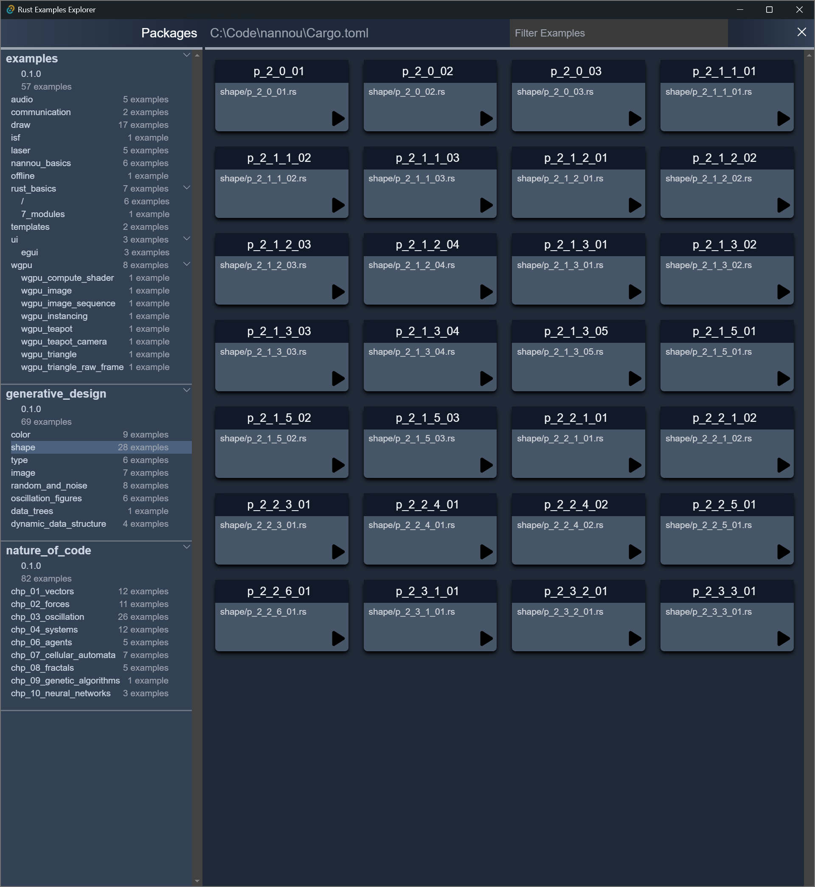

# Rust Examples Explorer

A small cross-platform GUI app written using [Tauri](https://tauri.app/) and
[Svelte](https://svelte.dev/) to make it easy to discover and run examples in
Rust projects. Here's a screenshot showing examples from the
[Bevy](https://bevyengine.org/) project:

